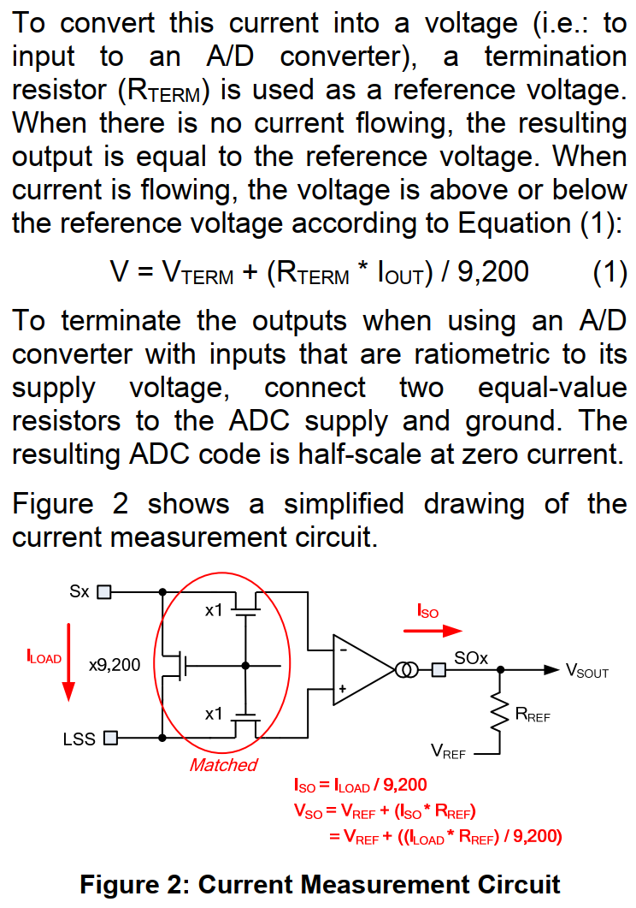
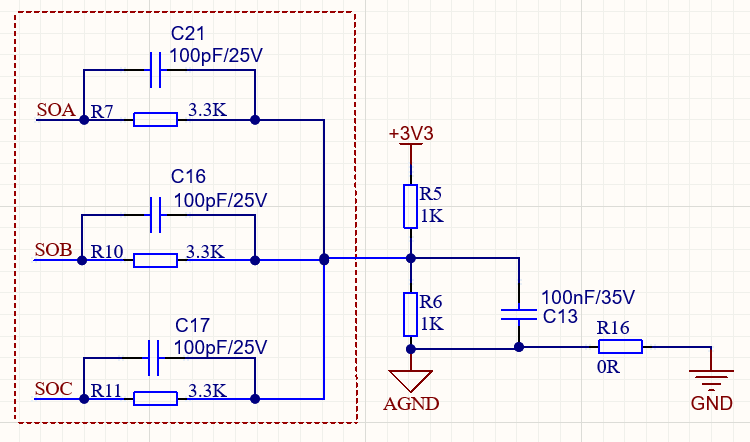

## 电机启动方案

# 硬件平台

- MCU: Artery AT32M416KBU7-4  
- 预驱+MOS: MP6540GU-Z
- 磁编: KTH7111
- CAN-FD: TCAN334GDCNR
- DC-DC: MP2456GJ-Z

# 系统设计

- TIM1  
  - Channel 1/2/3 PWM 输出，接预驱的 PWMA/PWMB/PWMC
  - Channel 4 作为 ADC 采样(相电流采样、温度采样)的触发源
- ADC2: 负责采集相电流、温度
  - SOA(PA7) -> ADC2 IN7
  - SOB(PB0) -> ADC2 IN8
  - SOC(PB2) -> ADC2 IN10
  - 温度(PA5) -> ADC2 IN5
- SPI2: 负责编码器数据采集
- ENA(PA12)/ENB(PA11)/ENC(PB10): 接预驱
- 预驱 nFAULT 接 MCU 的 PB3（后续考虑切换为 PA6, 可作为定时器刹车）
- 预驱 nSLEEP 接 MCU 的 PA15

# 电流采样

  

被测电流（如负载电流 Iload）经过一个比例为 1:9200 的变换器（可能是电流互感器或霍尔效应传感器），输出一个较小的电流 I_SO：

$$I_{\text{SO}} = \frac{I_{\text{LOAD}}}{9200}$$   

这个比例系数使得大电流被大幅缩小，便于后续处理。  
> 这一步是由红圈里的匹配 MOS 管对实现的电流镜电路完成的：
> - 一路 MOS 管的宽长比为 x9200，流过负载电流 I_LOAD  
> - 两路匹配的 MOS 管宽长比为 x1，作为镜像输出支路  
> - 根据电流镜的电流与宽长比成正比的特性，输出电流被精确缩小为 $I_{\text{LOAD}} / 9200$

> 优势：
> - 直接测量大电流会带来损耗、发热和干扰，通过 9200 倍的比例缩小，可大幅降低后端电路的功耗和设计难度
> - 匹配的 MOS 管保证了电流复制的精度，减少了工艺偏差带来的误差

最终输出电压公式：
$$
V_{\text{SO}} = V_{\text{REF}} + (R_{\text{REF}} \times I_{\text{LOAD}}) / 9,200
$$

推导过程：

- 缩放后的电流 $I_{\text{SO}}$ 流过终端电阻 $R_{\text{REF}}$，产生压降 $I_{\text{SO}} \times R_{\text{REF}}$
- 以参考电压 $V_{\text{REF}}$ 为直流偏置，将这个压降叠加上去，得到最终输出
$$
V_{\text{SO}} = V_{\text{REF}} + I_{\text{SO}} \times R_{\text{REF}}
$$
- 代入 $I_{\text{SO}} = {I_{\text{LOAD}}} / {9200}$，得到完整公式
​
> 其中：$V_{\text{TERM}} = V_{\text{REF}}, R_{\text{TERM}} = R_{\text{REF}}, I_{\text{OUT}} = I_{\text{LOAD}}$ 
​
 

- 红框内：三路信号的 RC 滤波网络(一阶 RC 低通滤波，滤除高频噪声)。截止频率：
$$
f_{\text{c}} = \frac{1}{2πRC} = \frac{1}{2π \times 3.3kΩ \times 100pF} ≈ 482kHz
$$
- 右侧：3.3V 电源分压产生的参考电压 V_REF，给三路信号做直流偏置(100nF 去耦电容，滤除 3.3V 电源上的纹波和噪声)
$$
V_{\text{REF}} = \frac{R6}{R5 + R6} \times 3.3V = 1.65V
$$
- 最终输出的信号，是以 V_REF 为中心上下浮动的电压，可直接送入 ADC

$$
V_{\text{SOx}} = V_{\text{REF}} + \frac{(R_{\text{REF}} \times I_{\text{LOAD}})}{9200}  
$$
例如：
$$V_{\text{SOA}} = 1.65 + \frac{(3300Ω \times I_{\text{LOAD}})}{9200}$$